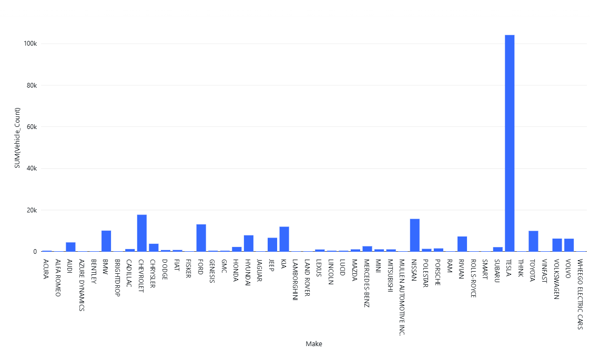

# EV-Data-Analysis-and-Visualization-Databricks

Project Overview: This project aimed to analyze and visualize electric vehicle registration data to uncover trends in model types, geographic distribution, and eligibility for clean alternative fuel programs using Databricks cloud-based analytics platform.

Objectives:
•Gain insights into electric vehicle adoption by city, make, and model and Identify trends in electric range and CAFV eligibility
•Leverage Databricks for scalable data processing and visualization

Responsibilities:
•Imported and cleaned raw vehicle registration data into Databricks using Delta Lake format, Created interactive visualizations including bar charts, pie charts, and time-series line graphs using Databricks’ built-in visualization tools
•Wrote SQL queries to aggregate, filter, and summarize key metrics (e.g., EV type, electric range, manufacturer trends) and explored relationships between electric range and eligibility status for government programs
•Documented insights and shared visual dashboards for stakeholders

Key Achievements:
•Identified that Battery Electric Vehicles (BEVs) with higher ranges are predominantly eligible for CAFV programs. Revealed Tesla and Nissan as top EV manufacturers in WA counties using grouped visual summaries
•Demonstrated practical use of Databricks SQL and Delta Lake in exploratory data analysis scenarios

Technologies Used:
•Databricks SQL, Delta Lake, CSV, DataFrames, Visualization tools (bar, pie, line charts)

## Visualizations

### 🔍 Feature

